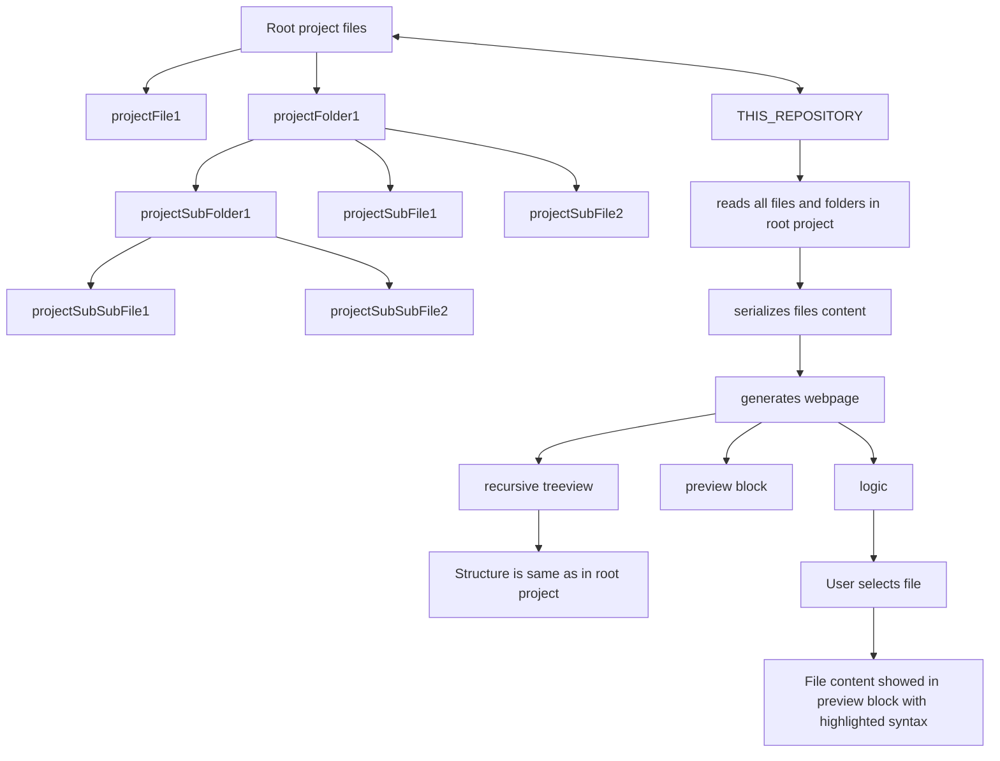

# project_structure

```mermaid
flowchart TD
    rootFiles[Root project files]
    rootFiles --> projectFile1
    rootFiles --> projectFolder1
    projectFolder1 --> projectSubFolder1
    projectFolder1 --> projectSubFile1
    projectFolder1 --> projectSubFile2
    projectSubFolder1 --> projectSubSubFile1
    projectSubFolder1 --> projectSubSubFile2
    rootFiles <--> THIS_REPOSITORY
    THIS_REPOSITORY --> step1[reads all files and folders in root project]
    step1 --> step2[serializes files content]
    step2 --> step3[generates webpage]
    step3 --> treeview[recursive treeview]
    treeview --> treeviewDescr[Structure is same as in root project]
    step3 --> preview[preview block]
    step3 --> logic
    logic --> s1[User selects file]
    s1 --> s2[File content showed in preview block with highlighted syntax]
```